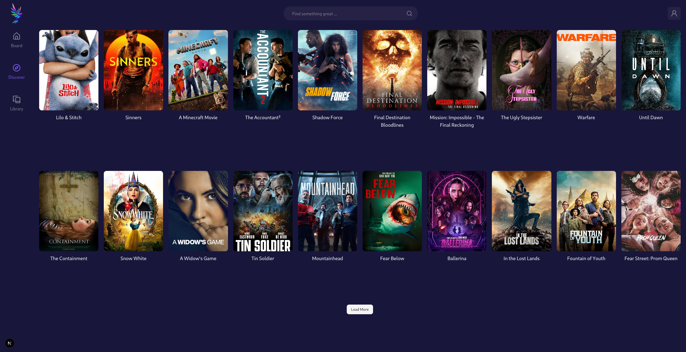
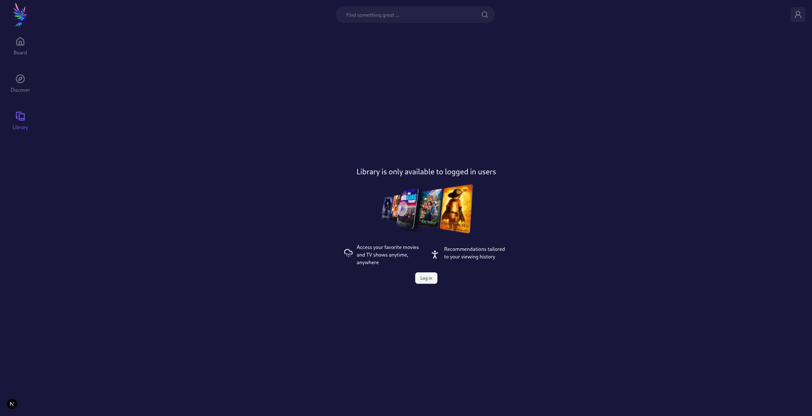

# MOVIE INFORMATICS

## Technologies Used

1. Next.js
2. TanStack Query
3. Zustand
4. Tailwind
5. Shadcn
6. Typescript
7. Jest
8. React Testing Library
9. Docker
10. GitHub Actions
11. Vercel

## UI Images

### Home Screen

### Discover

### Movie Details

### Library

## Demo link

<a href="https://savannah-movie-recommendation.vercel.app/">https://savannah-movie-recommendation.vercel.app/</a>

## How to run the project

1.  Clone the project from github.

        git clone https://github.com/RomanVII-2022/savannah-movie-recommendation.git

2.  Change directory into the project

        cd savannah-movie-recommendation

3.  Install dependencies

        npm install

4.  Run the project

        npm run dev

5.  Build Docker image (optional)

        docker image build -t movie:latest .

6.  Run the Docker container

        docker container run -p 3000:3000 -d movie:latest

# Reasons for Choosing The Above Technologies Based on Performance

## 1. Next.js

- **Server-Side Rendering (SSR) and Static Site Generation (SSG):** Improves initial page load speed by pre-rendering pages on the server.
- **Automatic Code Splitting:** Only loads the JavaScript needed for the current page, reducing bundle size.
- **Optimized Image and Asset Handling:** Built-in image optimization and smart asset loading improve page speed.
- **Fast Refresh:** Enhances developer experience with instant updates without losing state.

## 2. TanStack Query

- **Efficient Data Fetching and Caching:** Minimizes unnecessary network requests by caching and reusing data.
- **Background Data Syncing:** Keeps data fresh without blocking the UI, improving responsiveness.
- **Automatic Garbage Collection:** Removes unused cache data, reducing memory usage.
- **Built-in Support for Pagination and Infinite Queries:** Optimizes data loading and rendering for large datasets.

## 3. Zustand

- **Lightweight State Management:** Minimal API and small bundle size result in faster load times.
- **Selective Rendering:** Only components using specific state slices re-render, improving UI performance.
- **No Boilerplate:** Simplifies state logic and avoids performance overhead from complex abstractions.

## 4. Tailwind CSS

- **Utility-First Approach:** Generates only the CSS classes used, leading to smaller CSS bundle sizes.
- **No Runtime Styles:** Styles are precompiled, avoiding costly runtime CSS-in-JS processing.
- **Optimized for Purging:** Removes unused CSS automatically in production builds, improving load times.
- **Highly Customizable:** Enables fine-tuned styling without bloated stylesheets.

## 5. TypeScript

- **Early Error Detection:** Catches errors at compile time, preventing runtime performance issues.
- **Improved Code Quality and Maintainability:** Leads to better optimized and less buggy code.
- **Enhanced Developer Tooling:** Faster refactoring and navigation improve developer productivity, indirectly boosting performance.

## 6. Docker

- **Consistent Environment:** Ensures applications run identically across environments, reducing runtime issues.
- **Lightweight Containers:** Faster startup times compared to full VMs, improving deployment speed.
- **Resource Isolation:** Efficient use of system resources enhances application stability and performance.

## 7. GitHub Actions

- **Automated CI/CD:** Speeds up build, test, and deployment cycles, enabling faster performance improvements.
- **Parallel Job Execution:** Reduces total pipeline time, accelerating delivery.
- **Caching Mechanisms:** Speeds up repeated workflows by caching dependencies and build artifacts.

## 8. Vercel

- **Global CDN:** Delivers content from edge locations closest to users, drastically reducing latency.
- **Optimized for Next.js:** Seamless integration provides performance benefits like ISR (Incremental Static Regeneration).
- **Automatic Scaling:** Handles traffic spikes efficiently without degrading performance.
- **Zero-Configuration Deployments:** Faster deployment times mean quicker iteration and performance tuning.
